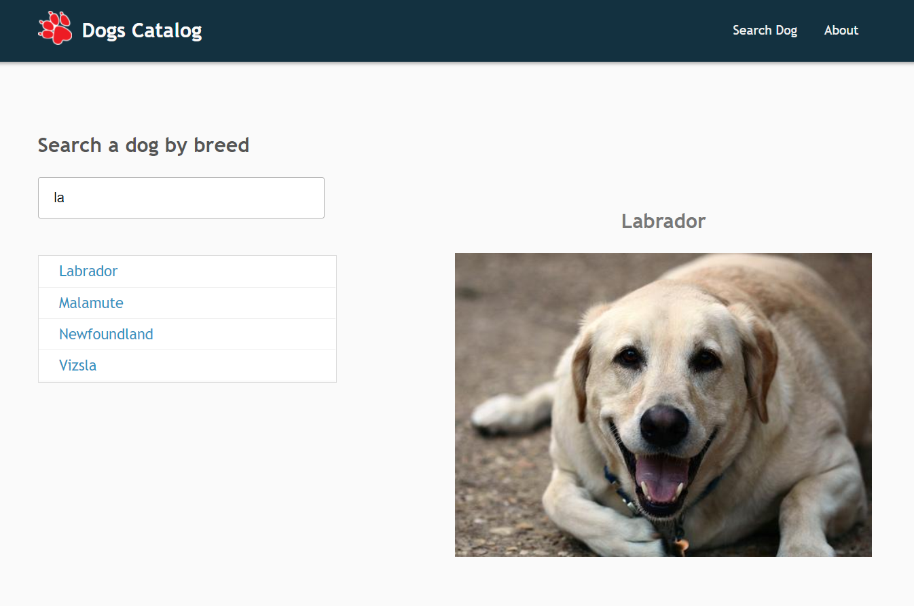

# [](https://www.gochandy.com/) ReactJS - Dogs Catalog App

> This is a ReactJS project made for learning the library with a small SPA and API connection...

###### NOTES
- The project stills improving (while learning)
- The API is from DOG CEO
- For Live Demo click on `Search Dog` (GHP has not SPA support)
- [View Live Demo on Github Pages](https://chandyalexcr.github.io/dog-app/)

###### PREVIEW
- Search Dog & View Image
# 

## Technologies involved
- [Webpack](https://webpack.js.org/) module bundler (and dev-server)
- [ReactJS](https://reactjs.org/) Javascript library for build modern web apps
- [React-Router-Dom](https://reacttraining.com/react-router/) for handling app routing on SPA
- [Axios](https://github.com/mzabriskie/axios) for make request to a server (API Requests)
- Babel, Babel Loader, Sass/Style Loaders

## Setup & Run
> Install NodeJS
> Clone this repo
> Then on the console:

``` bash

# install dependencies
npm install

# serve for dev with hmre
npm run dev

# build the app (create /docs/app-bundle.min.js)
npm run build

```
